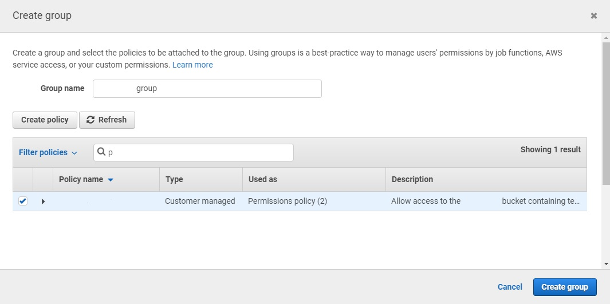

```{r setup, include=FALSE}
knitr::opts_chunk$set(echo = TRUE)
```

# Introduction

In `arxivdl` we create a package to facilitate responsibly downloading subsets of papers from arXiv. Our package makes use of and complements the `aRxiv` package's functions for getting paper metadata from the arXiv API.

This is useful for researchers interested in getting the full text of multiple PDFs, such as for text mining purposes. Current options for getting arXiv data either do not retrieve the full PDFs, do not allow querying, or involve writing more code. While geared towards downloading papers from arXiv, the package's primary can be used to download other PDF collections as well.

The remainder of this paper is structured as follows: first, we introduce the package's key functions and its supporting functions. Then we provide a longer example of `arxivdl`'s functionality. Finally, we outline limitations to the current package and future directions for its development.


# Key function

The main function in `arxivdl`is `download_pdf()`, which downloads and saves PDFs to either a local folder or to an Amazon S3 bucket.

**`download_pdf()`** takes a data frame, such as one returned by `get_records()`, that contains the URLS of PDFs to download and file names to save PDFs under. It also optionally takes the name of the data frame column containing PDF URLs, the name of the column containing file names to use, and the directory or Amazon Web Services S3 bucket to download papers to. If the link column is not specified, the function looks for the "link_pdf" column. If the file name column is not specified, the function looks for the "id" column. If a save location is not specified, PDFs will be downloaded to the user's current working directory.

# Supporting functions

Supporting functions in `arxivdl` include `get_record_count()`, which can be used to understand how many papers were submitted to a specified arXiv subject area over a given timespan, and `get_records()`, which retrieves metadata for papers submitted to a specified arXiv subject area in a given timespan. The resulting data frame can then be passed to `download_pdf()` to download the full papers. A utility function, `clean_titles()`, that creates file names from paper titles is also included.

**`get_record_count()`** takes as arguments the arXiv categories to query and the time period over which to search, and returns the number of papers that fit those criteria. It helps scope out the number of papers to be downloaded.

**`get_records()`** takes as arguments the arXiv categories to query, the time span to search, and the maximum number of records to retrieve. If the function is called in interactive mode (e.g., from the R console), specifying the limit is optional -- the function will call `get_record_count()`, estimate the record retrieval time, and ask the user if they wish to proceed. `get_records()` returns a data frame containing metadata on all papers meeting the criteria, ordered from earliest submission date. An example use case for this is 

**`clean_titles()`** takes a data frame and the name of the column to clean for use as file names. It converts text to lowercase, removes punctuation, and replaces spaces with underscores. These names provide a better sense of file contents than the default arXiv paper identifiers.

# Vignette

## All papers between certain dates in certain sub-groups
```{r eval=FALSE}
library(arxivdl)

# check how many computer science graphics papers from January 2020 will be returned
paper_count <- get_record_count("cs.GR", "20200101 TO 20200201")

# get metadata on all graphics papers in January 2020
metadata <- get_records("cs.GR", "20200101 TO 20200201", paper_count)

# download papers to data folder within working directory
download_pdf(metadata, directory = "./data")
```

## Using AWS buckets

`download_pdf()` also supports saving files to an Amazon Web Service S3 bucket. S3 access credentials should be set up before calling `download_pdf()`; the easiest way to do this is by setting them with `Sys.setenv()`. See the Appendix for detailed instructions on setting up S3 storage and generating credentials.

```{r eval=FALSE}
# set up AWS credentials
Sys.setenv(
  "AWS_ACCESS_KEY_ID" = "your-key-here",
  "AWS_SECRET_ACCESS_KEY" = "your-secret-here",
  "AWS_DEFAULT_REGION" = "us-east-2" # replace region as appropriate
)

# get metadata for the first 20 graphics papers published in 2019
papers <- get_records("cs.GR","2019 TO 2020", lim = 20)

# create file names based on paper titles
papers$file_name <- clean_titles(papers)

# download files to s3 bucket
download_pdf(papers, fname = "file_name", bucket = "my-s3-bucket")

```


# Next steps and cautions

While the `arxivdl` package introduces delays between requests made to arXiv, it does not currently prohibit the user from making large requests of the site. Users are expected to exercise caution when calling `download_pdf()`. One next step is to place limits on how large a data frame can be passed to `download_pdf()` and provide suggestions for users to break down large requests into smaller parts. However, if bulk data on all papers is required, [arXiv's bulk PDF access](https://arxiv.org/help/bulk_data_s3) option may be a better solution.

This package is geared towards facilitating paper downloads by submission time period and subject area. As such, it does not currently support other types of queries, such as searching for specific authors or searching by the date of last update.

\newpage
# Appendix: AWS S3 Setup

While AWS S3 storage can be public, storage buckets are private by default. The best practice is to set up security policies and credentials to control access to storage buckets. This appendix walks through S3 storage setup and credential creation. It assumes you have an AWs account but nothing more.

## Creating a Bucket
1. In the AWS management console, navigate to the **S3 console** and click the **Create Bucket** button. 
2. The key part of the Create Bucket wizard is the first screen, where you give the bucket a unique name. The closest region should be selected by default, but you can select a different one if needed.
  

3. Step through the rest of the wizard. You can accept the defaults -- they can be changed later if needed.

## Creating Access Keys
Once the S3 bucket exists, the next steps are setting up an Identity and Access Management (IAM) policy, creating a user, and generating credentials to access the storage.

1. In the **IAM console**, navigate to **Policies**. AWS provides some pre-configured policies that provide access to all S3 buckets in the account. These include the DataScientist, AmazonS3ReadOnlyAccess, and AmazonS3FullAccess policies. If you choose to use one of these predefined policies, proceed to Step 5. However, if you want to limit access to a specific bucket, it's best to create a custom policy.  
  
  
2. In the **JSON tab**, copy and paste the below policy, editing the bucket name as needed. This policy will allow a credential-holder to see the names of all the buckets owned by the AWS account and will grant full access to the specified bucket.  
  

```json
{
    "Version": "2012-10-17",
    "Statement": [
        {
            "Effect": "Allow",
            "Action": [
                "s3:ListAllMyBuckets"
            ],
            "Resource": [
                "arn:aws:s3:::*"
            ]
        },
        {
            "Effect": "Allow",
            "Action": [
                "s3:*"
            ],
            "Resource": [
                "arn:aws:s3:::myexamplebucket",
                "arn:aws:s3:::myexamplebucket/*"
            ]
        }
    ]
}
```

3. (Optional) If you switch to the **Visual editor** tab, you will see warnings as full access permissions include some resources that haven't been set up, but they can be ignored. You can also expand the actions menu here and fine-tune permissions.

4. On the **Review policy** screen, give the policy a name. The summary might show a notice that the policy defines some actions, resources, or conditions that do not provide permissions. You can ignore this notice and click **Create policy**.

5. Head to the **Users** section of the IAM console and **Add user**. Give the user a name. For AWS access type, select **Programmatic access**.  
  
  
6. In the **Set permissions** screen, choose **Add user to group**, then **Create group**.  
  

7. In the Create group dialogue box, give the group a name, then search for and attach the chosen policy and create the group.  
 

8. Click through the Tags screen, review and **Create user**.  

9. The next screen will provide the access key and secret key.  
  
  
10. The secret key won't be shown again, but if you need you can generate a new key at any time via the **Users** section. Click on the user name, then the **Security credentials** tab to create a new access key or deactivate an old one.  
  